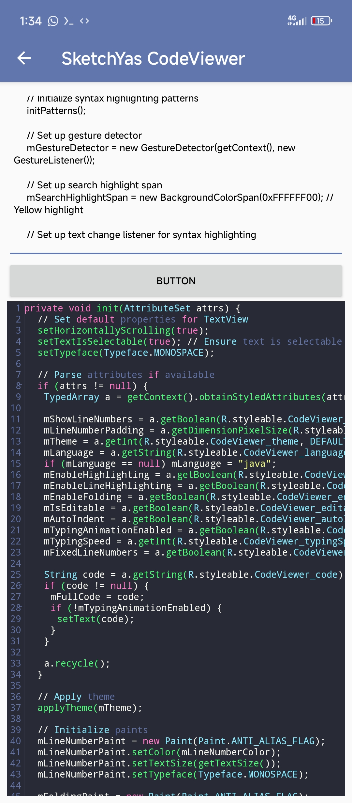
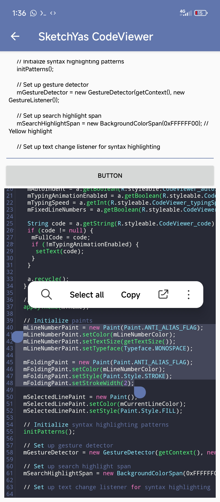

CodeViewer

CodeViewer is a versatile and feature-rich code viewing component designed to enhance the experience of displaying code in your Android app. It supports multiple color schemes, line number toggling, language syntax highlighting, typing animations, and more.

---

**Features**

**• Show/Hide Line Numbers**: Easily toggle the visibility of line numbers.  
**• Fixed/Free Line Numbers Bar**: Choose between a fixed or free-moving line number bar.  
**• Multiple Color Schemes**: Switch between various color schemes for syntax highlighting.  
**• Multi-Language Support**: Supports various programming languages, automatically detecting the appropriate syntax.  
**• Typing Animation**: Enable typing animations with customizable speed for a more dynamic experience.  
**• Folding**: Enable or disable code folding to hide or show code blocks.  
**• Text Selection**: Enable or disable the ability to select text within the code viewer.  

---

**Screenshots**
  

  

---
